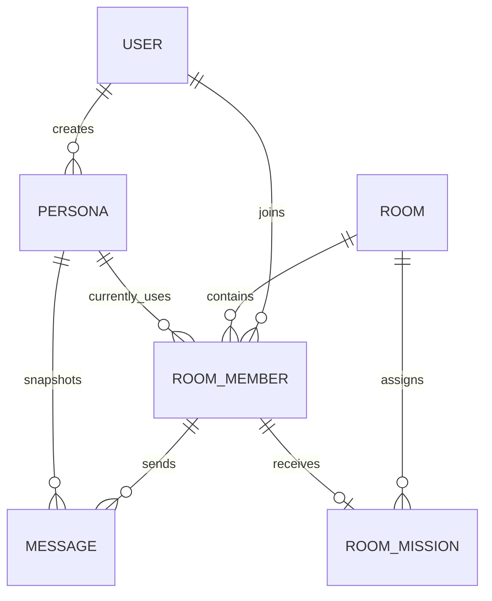
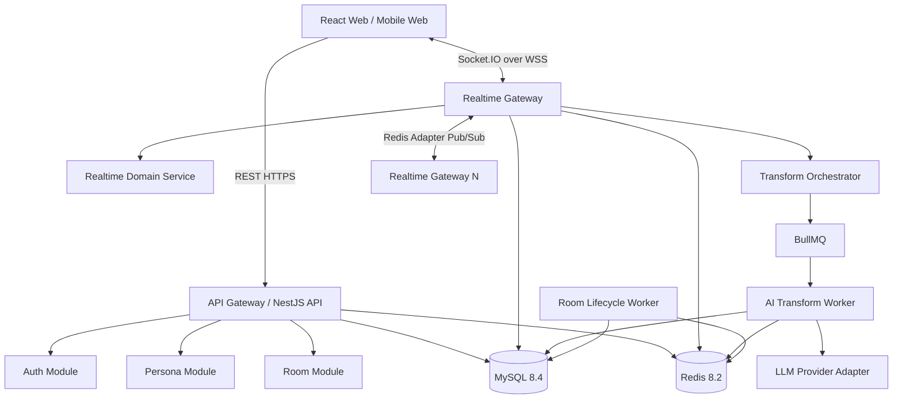
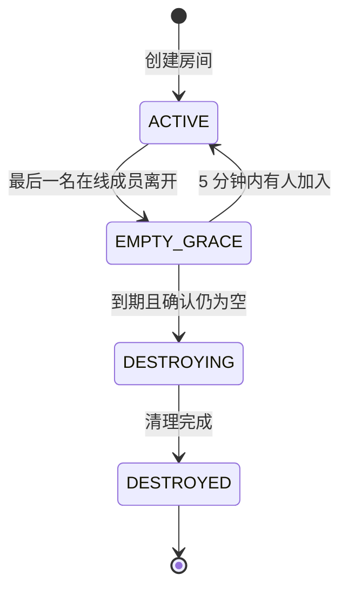
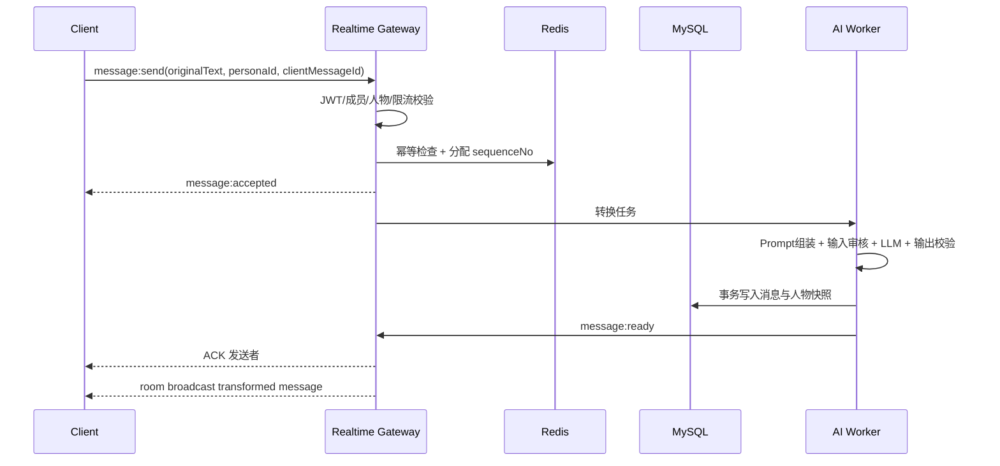

# 离谱聊天室完整技术架构文档

> 版本：v1.0  
> 日期：2026-09-11  
> 状态：用于产品评审、研发排期与 MVP 实施  
> 目标：从单机 HTML Demo 升级为支持人物管理、动态角色切换、临时聊天室、WebSocket 实时通信、主题任务和 AI 文本转换的多人系统。

## 1. 执行摘要

离谱聊天室不是“带几个人设皮肤的聊天软件”，而是一套实时的角色化表达系统。系统中的原始信息先经过人物设定转换，再作为最终消息进入聊天室；用户可在同一房间中随时切换已启用人物，主题房间还会向每名首次加入者私密分配任务，引导参与者通过离谱表达完成目标。

本方案选择：

| 层级 | 技术选择 | 原因 |
|---|---|---|
| Web 前端 | React 19 + TypeScript + Vite | 复杂状态、实时消息和多页面交互较适合组件化开发；实际锁文件固定已验证版本 |
| 客户端状态 | TanStack Query + Zustand | 服务端状态与瞬时 UI 状态分离 |
| 实时客户端 | Socket.IO Client | 自动重连、确认回调、房间广播能力成熟 |
| 后端 | Node.js 22 LTS + NestJS 12 + TypeScript | 与前端共享类型；REST、WebSocket、依赖注入和模块边界统一 |
| HTTP 引擎 | Fastify Adapter | 保留 NestJS 开发体验并降低 HTTP 开销 |
| 实时服务 | NestJS Gateway + Socket.IO | 直接支持房间、事件确认、鉴权与 Redis 横向扩展 |
| ORM/迁移 | Prisma 或 Drizzle（二选一，默认 Prisma） | 类型安全、迁移清晰；关键并发逻辑允许写原生 SQL |
| 权威数据库 | MySQL 8.4 LTS | 保存人物、版本、房间、成员关系、任务和房间存活期消息 |
| 临时/实时状态 | Redis 8.2 | 在线状态、房间路由、限流、幂等、序号和跨实例广播 |
| 异步任务 | BullMQ | AI 转换、清理、审核和重试任务使用 Redis 队列 |
| AI 适配 | Provider Adapter | 不绑定模型供应商；统一结构化输出、超时、降级和审计 |
| 本地环境 | Docker Compose | 一条命令启动 MySQL 与 Redis，后续可加入 API/Worker |

React 官方当前版本页列出的最新版本为 19.3；Vite 官方博客当前列出 8.1；NestJS 官方文档显示 Gateway 原生支持 Socket.IO 与 `ws`。本方案选 Socket.IO，是因为本产品比极致传输性能更需要房间、重连、ACK 和跨实例广播。[React 版本说明](https://react.dev/versions)、[Vite 官方发布信息](https://vite.dev/blog)、[NestJS WebSocket Gateway](https://docs.nestjs.com/websockets/gateways)

## 2. 产品领域定义

### 2.1 四种核心身份

系统必须区分四个不同概念，避免后续出现“身份 ID 到底是谁”的混乱：

1. `User`：真实使用者账号。
2. `Persona`：可被选择的人物设定，例如程序员、英语老师、阴阳怪气产品经理。
3. `RoomMember`：某个用户在某个聊天室中的成员实例。
4. `MessagePersonaSnapshot`：发送某条消息时所采用的人物及版本快照。

关系如下：



用户不是“变成”人物；用户在每个房间的成员记录上持有 `currentPersonaId`。每次发言必须把 `userId + roomMemberId + personaId + personaVersion` 一起写入消息。

### 2.2 人物模型

一个可用人物至少包括：

- 名称与一句话介绍。
- 身份背景：这个人是谁、所处环境、知识边界。
- 发言习惯：句式、词汇、长度、口癖、格式偏好。
- 态度风格：热情/冷漠、攻击性、耐心、戏剧化程度。
- 转换规则：必须保留什么、禁止添加什么、遇到不确定内容怎么说。
- 正反例：输入、理想输出、错误输出。
- 视觉配置：颜色、符号、消息载体；它不是模型提示词的一部分。
- 可见性、启用状态与版本号。

人物删除默认采用软删除。已产生消息继续保留当时的人物快照；禁用人物不能再选择，但不会破坏历史消息。

### 2.3 房间模型

房间分为：

- 普通聊天室：自由聊天，无任务。
- 主题聊天室：绑定一个主题模板，首次加入时私密分配任务。

每个房间拥有内部 `roomId` 和对外 `roomCode`：

- `roomId`：服务端内部 ULID/数据库 ID，不对用户展示。
- `roomCode`：8 位大写字母与数字，排除 `0/O/1/I` 等易混淆字符。
- 建议字符集：`23456789ABCDEFGHJKLMNPQRSTUVWXYZ`。
- MySQL 对 `room_code` 建唯一索引，生成冲突时最多重试 5 次。
- 加房仅允许精确搜索；对错误尝试限流，避免遍历有效房间。

## 3. 范围与非目标

### 3.1 v1 必须完成

- 人物的创建、读取、修改、删除、启用与禁用。
- 公共人物与用户私有人物。
- 人物版本与提示词快照。
- 创建普通/主题聊天室。
- 通过房间 ID 精确搜索并加入。
- WebSocket 实时加入、离开、聊天、重连和角色切换。
- 空房 5 分钟后可靠销毁。
- 主题房间首次加入私密任务，全屏展示一次。
- AI 文本转换、超时重试、审核和模板降级。
- Docker Compose 一键启动 MySQL + Redis。

### 3.2 暂不纳入

- 好友关系、私聊、朋友圈。
- 语音、视频、文件消息。
- 房间公开推荐流。
- 角色交易或付费市场。
- 复杂排名与赛季系统。
- 端到端加密。

## 4. 系统总体架构



MVP 可把 API、Realtime Gateway 和 Worker 放在同一 NestJS 仓库中，作为三个独立进程部署。模块化单体足以支持首轮验证；不要一开始拆微服务。

### 4.1 推荐仓库结构

```text
lipu-chat/
├── apps/
│   ├── web/                  # React + Vite
│   ├── api/                  # REST + Socket.IO Gateway
│   └── worker/               # AI、审核、房间清理任务
├── packages/
│   ├── contracts/            # DTO、事件名、Zod schema
│   ├── persona-engine/       # Prompt 组装、输出校验、降级模板
│   ├── database/             # ORM schema、migration、repository
│   └── observability/        # logger、trace、metrics
├── infra/
│   ├── mysql/init/
│   └── redis/
├── compose.yaml
├── .env.example
└── pnpm-workspace.yaml
```

## 5. 前端架构

### 5.1 页面

| 路由 | 功能 |
|---|---|
| `/` | 聊天室大厅、创建房间、按 ID 搜索 |
| `/personas` | 已启用人物浏览与选择 |
| `/personas/manage` | 人物 CRUD、启停、预览测试 |
| `/personas/:id/edit` | 人物设定编辑、示例和版本记录 |
| `/rooms/new` | 普通/主题房创建 |
| `/rooms/:roomCode` | 实时聊天室 |

### 5.2 状态边界

- TanStack Query：人物列表、房间信息、历史消息、任务状态。
- Zustand：当前用户、当前房间人物、输入草稿、弹窗和连接状态。
- Socket.IO：只负责实时事件，不作为长期状态仓库。
- 服务端是房间成员和人物选择的最终权威；客户端切换角色必须等待服务端 ACK。

### 5.3 断线与重连

- 页面持有 `lastReceivedSequenceNo`。
- 断线重连后发送 `room:resume { roomCode, lastSequenceNo }`。
- 服务端先从 MySQL/Redis 补发缺失消息，再恢复实时广播。
- 客户端按 `(roomId, sequenceNo)` 去重和排序。
- 本地发送使用 `clientMessageId`，重复重试不会重复落库。
- UI 明确显示：连接中、已重连、转换中、发送失败、人物已被禁用。

## 6. 后端模块

| 模块 | 责任 |
|---|---|
| Auth | 匿名会话/正式账号、JWT、封禁检查 |
| Persona | 人物 CRUD、权限、启停、版本快照、试说 |
| Room | 创建、搜索、加入、离开、销毁、容量控制 |
| Membership | 用户在房间内的人物状态与首次加入状态 |
| Realtime | Socket 鉴权、房间广播、在线状态、重连补偿 |
| Message | 幂等、序号、落库、查询、删除策略 |
| Transform | Prompt 组装、模型调用、结构校验、降级 |
| Mission | 任务分配、私密下发、完成/失败判定 |
| Moderation | 输入/输出审核、限流、举报扩展点 |
| Lifecycle | 空房倒计时、销毁、垃圾数据清理 |
| Observability | 日志、指标、追踪、审计事件 |

NestJS Gateway 可以复用依赖注入、Guard、Pipe、Interceptor；WebSocket 鉴权使用 Gateway Guard，异常使用 `WsException`。[NestJS Gateway](https://docs.nestjs.com/websockets/gateways)、[NestJS WebSocket Guard](https://docs.nestjs.com/websockets/guards)

## 7. 数据存储职责

### 7.1 MySQL：权威、可恢复的数据

- 用户。
- 人物与人物版本。
- 主题模板。
- 活跃房间元数据。
- 房间成员关系。
- 私密任务分配。
- 房间存活期间的消息与人物快照。

MySQL 选择 8.4 LTS 而非 Innovation 分支，以换取较稳定的升级节奏。官方将 8.4 明确列为 LTS，并提供容器部署文档。[MySQL LTS 说明](https://dev.mysql.com/doc/refman/8.4/en/mysql-releases.html)、[MySQL Docker 部署](https://dev.mysql.com/doc/refman/8.4/en/linux-installation-docker.html)

### 7.2 Redis：可重建、低延迟的数据

推荐 Key 设计：

| Key | 类型 | 内容/TTL |
|---|---|---|
| `session:{sessionId}` | String/Hash | 登录会话；按 Token TTL |
| `room:code:{code}` | String | `roomId`；房间销毁时删除 |
| `room:{id}:presence` | Set | 在线 `roomMemberId` |
| `room:{id}:sockets:{memberId}` | Set | 成员的多个 socket ID |
| `room:{id}:member:{memberId}` | Hash | 当前人物、连接状态；TTL 10 分钟续期 |
| `room:{id}:seq` | String | 房间消息序号，`INCR` |
| `room:destroy:schedule` | ZSet | member=`roomId`，score=`destroyAtMillis` |
| `room:{id}:mission:{memberId}` | String | 私密任务缓存；房间生命周期 TTL |
| `idem:message:{userId}:{clientId}` | String | 幂等结果；TTL 10 分钟 |
| `rate:*` | String/Hash | 搜索、发言、创建、AI 调用限流 |

Redis 官方建议使用冒号组织 Key 名称，并支持基于 TTL 的自动清理。[Redis Key 与 TTL](https://redis.io/docs/latest/develop/use/keyspace/)

### 7.3 为什么不能只靠 Redis 过期通知销毁房间

Redis 官方说明：

- Keyspace notification 默认关闭。
- Pub/Sub 是 fire-and-forget，订阅者断线时事件会丢失。
- `expired` 事件在 Redis 实际删除 Key 时产生，不保证恰好在 TTL 到零时触发。

因此它只能做辅助信号，不能作为房间销毁的唯一机制。[Redis Keyspace Notifications](https://redis.io/docs/latest/develop/pubsub/keyspace-notifications/)

## 8. 空房 5 分钟自动销毁

### 8.1 状态机



### 8.2 算法

最后一个 socket 离开时：

1. 从 Redis presence Set 移除 socket/成员。
2. 延迟 2～5 秒再次确认成员是否完全离线，避免页面刷新触发假离开。
3. 若确认为空，在 MySQL 把房间改为 `EMPTY_GRACE`，记录 `empty_since` 和 `destroy_after=now+5min`。
4. `ZADD room:destroy:schedule destroyAt roomId`。

有人加入时：

1. 数据库事务/条件更新把 `EMPTY_GRACE` 恢复为 `ACTIVE`。
2. `ZREM room:destroy:schedule roomId`。
3. 加入 presence Set，并广播成员上线。

Lifecycle Worker 每 5～10 秒执行：

1. 通过带 TTL 的 Redis Lock 选出一个清理者。
2. `ZRANGEBYSCORE room:destroy:schedule -inf now LIMIT 0 100`。
3. 对每个房间再次确认 Redis presence 为空。
4. 在 MySQL 执行条件更新：仅 `status=EMPTY_GRACE AND destroy_after<=NOW()` 才改成 `DESTROYING`。
5. 向房间广播 `room:destroyed`，拒绝新连接。
6. 删除 Redis 房间 Key，级联删除任务和消息，最后标记 `DESTROYED`。
7. 清理失败进入重试队列；MySQL 的 `idx_rooms_cleanup` 允许每日补偿扫描。

重要语义：产品层面的“5 分钟销毁”定义为到期后不可再加入；物理数据清理由异步任务在数秒内完成。这样不会因为删除耗时产生竞态。

## 9. 人物 CRUD 与版本策略

### 9.1 权限

- 系统人物：仅管理员修改，所有用户可选择已启用版本。
- 公共人物：创建者可修改；管理员可禁用。
- 私有人物：仅创建者可读写和选择。
- 人物被禁用后，使用者在下一次发言时收到 `PERSONA_DISABLED`，必须切换。
- 删除是软删除；只有无引用且超过保留期后才物理删除。

### 9.2 更新事务

更新人物时：

1. 校验字段长度、结构和权限。
2. 把当前完整配置写入 `persona_versions`。
3. `personas.version + 1` 并更新当前配置。
4. 清除人物缓存。
5. 向正在使用该人物的连接推送 `persona:updated`。

每条消息保存人物快照，确保历史消息可解释、审核可复现。

## 10. 消息发送与 AI 转换链路



### 10.1 关键原则

- 原文绝不能由客户端自行转换后直接广播。
- 服务端依据 `roomMember.currentPersonaId` 确认人物，不能信任客户端提交的显示名或人物描述。
- Prompt 使用数据库中的人物版本，而非客户端传入的配置。
- 消息最大长度建议 500 字；转换结果最大 1,500 字。
- AI 总超时建议 8 秒，3 秒时前端展示“人格正在组织语言”。
- 超时后使用本地模板转换并标记 `FALLBACK`，聊天不能因模型故障彻底停止。
- 原始文本是否保存必须产品化决定；默认仅在房间生命周期内保存，房间销毁时一起删除。

### 10.2 Prompt 结构

```text
System safety policy
→ Persona identity background
→ Speaking habits
→ Attitude and style
→ Must preserve / must not invent rules
→ Positive and negative examples
→ Room topic and limited recent context
→ User original text (delimited as untrusted input)
→ Strict JSON output schema
```

推荐结构化响应：

```json
{
  "transformedText": "...",
  "format": "PLAIN|MARKDOWN|CODE",
  "language": "javascript|null",
  "preservedMeaning": true,
  "safety": "PASS|REWRITE|BLOCK"
}
```

### 10.3 防提示词注入

- 用户原文用明确分隔符包裹，标记为数据而非指令。
- 人物配置中的规则也视作不可信内容，由创建接口过滤危险指令。
- 模型输出必须过 JSON Schema，失败只允许一次修复请求。
- 输入和输出分别经过安全检查。
- 模型密钥只在 Worker 环境变量中，永不传前端。

## 11. WebSocket 协议

统一信封：

```ts
type EventEnvelope<T> = {
  eventId: string;       // ULID
  requestId?: string;
  roomCode?: string;
  serverTime: string;    // ISO 8601
  data: T;
};
```

### 11.1 客户端 → 服务端

| 事件 | 载荷 | ACK |
|---|---|---|
| `room:join` | `roomCode` | 成员、房间、当前人物、任务（私密） |
| `room:leave` | `roomCode` | `ok` |
| `room:resume` | `roomCode,lastSequenceNo` | 缺失消息 |
| `persona:switch` | `roomCode,personaId` | 新人物与版本 |
| `message:send` | `roomCode,clientMessageId,originalText` | accepted/错误码 |
| `mission:complete` | `roomCode,missionId,evidence?` | 判定结果 |
| `typing:set` | `roomCode,isTyping` | 可不 ACK |

### 11.2 服务端 → 客户端

| 事件 | 说明 |
|---|---|
| `member:joined` / `member:left` | 在线成员变化 |
| `member:persona_changed` | 某成员切换人物 |
| `message:accepted` | 消息进入转换队列 |
| `message:ready` | 最终角色化消息 |
| `message:failed` | 失败及是否可重试 |
| `mission:assigned` | 只发给当前成员的 socket |
| `mission:progress` | 私密进度 |
| `room:empty_countdown` | 房间进入销毁倒计时 |
| `room:destroyed` | 房间已关闭 |
| `persona:updated` / `persona:disabled` | 人物变化 |

### 11.3 多实例扩展

Socket.IO 使用 Redis Adapter，把不同 API 实例上的房间广播连接起来。NestJS 官方 Adapter 文档给出了 Redis Pub/Sub 适配方式，并提示：负载均衡多实例时，应使用纯 WebSocket transport，或为长轮询开启粘性会话；Redis Adapter 本身不能替代粘性会话配置。[NestJS Redis WebSocket Adapter](https://docs.nestjs.com/v8/websockets/adapter)

MVP 建议客户端与服务端都设置 `transports: ['websocket']`，简化负载均衡。

## 12. REST API 草案

### 12.1 人物

```text
GET    /api/v1/personas?enabled=true&visibility=PUBLIC
POST   /api/v1/personas
GET    /api/v1/personas/:personaId
PATCH  /api/v1/personas/:personaId
DELETE /api/v1/personas/:personaId
POST   /api/v1/personas/:personaId/enable
POST   /api/v1/personas/:personaId/disable
GET    /api/v1/personas/:personaId/versions
POST   /api/v1/personas/:personaId/preview
```

### 12.2 房间

```text
POST   /api/v1/rooms
GET    /api/v1/rooms/by-code/:roomCode
POST   /api/v1/rooms/:roomCode/join-token
GET    /api/v1/rooms/:roomCode/messages?afterSequence=120
DELETE /api/v1/rooms/:roomCode             # 房主主动关闭
```

搜索接口只支持完整 8 位 ID；不存在、已销毁、无权限统一返回模糊错误，降低房间枚举风险。

## 13. 主题聊天室与私密任务

### 13.1 分配规则

- 每个 `RoomMember` 只在该房间首次加入时分配一次。
- 服务端从主题模板任务池中选择，写入 `room_missions` 后再私密下发。
- 数据库唯一键 `(room_id, room_member_id)` 防止重连重复领取。
- 任务不进入普通房间广播，不可由其他用户 API 查询。
- 首次 ACK 返回 `showFullscreen=true`；客户端全屏展示并要求用户主动确认。
- 重连时若任务未确认，可再次提示；已确认后只在个人任务抽屉查看。

### 13.2 任务示例

- “在不直接说‘鸡蛋’的前提下，让至少两个人猜出你早餐吃了什么。”
- “让某位玩家主动使用一次程序员身份。”
- “把话题自然引到辞职，但不能出现‘工作’和‘老板’。”
- “发现其他人的任务，并用当前人物的表达方式公开指认。”

### 13.3 判定策略

MVP 先采用用户主动点击完成 + 房间投票，降低 AI 误判。后续可增加 AI 裁判，但 AI 只给建议，涉及胜负时保留投票或可解释证据。

## 14. 数据一致性与并发

- 房间加入：事务锁定 Room，检查 `ACTIVE/EMPTY_GRACE`、容量与权限。
- 人物切换：条件更新 `room_members.current_persona_id`，要求人物仍启用。
- 消息序号：Redis `INCR` 分配；Redis 故障时退回数据库序列表或拒绝新消息，不能生成重复序号。
- 消息幂等：唯一键 `(user_id, client_message_id)`。
- 房间 ID：MySQL 唯一索引是最终防冲突保障。
- 任务分配：唯一键 `(room_id, room_member_id)`。
- 销毁与加入竞态：房间状态条件更新决定胜负；进入 `DESTROYING` 后禁止复活。
- Redis 是派生状态；服务重启可由 MySQL 恢复活跃房间基本信息。

## 15. 安全设计

### 15.1 身份与访问

- MVP 可支持匿名访客，但服务端仍签发匿名 `userId + JWT`。
- WebSocket 握手校验短期 Token；不要把长期 Token 放 URL query。
- 每个事件再次校验用户是否属于房间。
- 房间 code 不是权限凭证；私密房未来应额外使用邀请码或密码。

### 15.2 限流建议

| 行为 | 建议限制 |
|---|---|
| 房间搜索 | 10 次/分钟/IP + 用户 |
| 创建房间 | 5 次/小时/用户 |
| 加入失败 | 20 次/10 分钟/IP |
| 发消息 | 10 条/10 秒，60 条/分钟 |
| 人物切换 | 10 次/分钟 |
| AI 预览 | 20 次/小时/用户 |

### 15.3 内容与隐私

- 原始文本与转换文本都要审核；“只是角色扮演”不能成为绕过安全策略的理由。
- `original_text` 只对发送者和审核系统可见，不广播给其他成员。
- 房间销毁后消息物理删除；安全审计如必须保留，应单独脱敏并明确告知。
- 日志禁止记录完整 JWT、原始消息、模型密钥和 Redis 密码。
- 前端 Markdown 经过白名单清洗；代码块只渲染不执行。

## 16. 可观测性

### 16.1 核心指标

- `websocket_connections_active`
- `room_active_count` / `room_empty_grace_count`
- `room_destroy_delay_seconds`
- `message_transform_latency_ms` P50/P95/P99
- `message_transform_fallback_rate`
- `message_duplicate_rejected_total`
- `socket_reconnect_total`
- `mission_assigned/completed_total`
- `persona_switch_total`

### 16.2 日志与追踪

每条请求/事件贯穿：`requestId → userId → roomId → clientMessageId → transformJobId → modelTraceId`。日志采用 JSON；接入 OpenTelemetry 后可串联 HTTP、WebSocket、队列与模型调用。

## 17. Docker 一键启动

仓库已提供：

- `compose.yaml`
- `.env.example`
- `infra/mysql/init/001_schema.sql`
- `infra/redis/redis.conf`

首次运行：

```bash
cp .env.example .env
docker compose up -d
docker compose ps
```

健康检查：

```bash
docker compose exec mysql mysqladmin ping -h 127.0.0.1 -uroot -p
docker compose exec redis sh -c 'redis-cli -a "$REDIS_PASSWORD" ping'
```

停止但保留数据：

```bash
docker compose down
```

彻底删除本地数据库卷会丢失数据，因此不放进常规操作说明；需要重置开发环境时应明确执行并确认。

Compose 使用官方推荐的 Compose Specification；MySQL/Redis 均挂载数据卷并配置健康检查。[Docker Compose Specification](https://docs.docker.com/compose/compose-file/)、[Redis Docker 指南](https://redis.io/docs/latest/operate/oss_and_stack/install/install-stack/docker/)

## 18. 环境变量规划

```text
NODE_ENV
PORT
DATABASE_URL
REDIS_URL
REDIS_PASSWORD
JWT_ACCESS_SECRET
JWT_REFRESH_SECRET
PUBLIC_WEB_ORIGIN
LLM_PROVIDER
LLM_API_KEY
LLM_MODEL
TRANSFORM_TIMEOUT_MS
ROOM_EMPTY_TTL_SECONDS=300
MESSAGE_RETENTION_MODE=ROOM_LIFETIME
```

生产环境使用 Secrets Manager/Kubernetes Secret，不提交 `.env`。

## 19. 测试策略

### 19.1 单元测试

- 房间 code 生成与冲突重试。
- 人物版本快照。
- Prompt 构建和 JSON 输出校验。
- 空房状态机。
- 任务分配幂等。

### 19.2 集成测试

- MySQL 事务、唯一键和级联删除。
- Redis presence、ZSet 调度和幂等键。
- Socket 鉴权、加入、角色切换、消息 ACK。
- AI 超时后的模板降级。

### 19.3 端到端与故障测试

- 两个浏览器加入同房并实时收发。
- 同一用户刷新页面不触发房间误销毁。
- 最后一人离开 4:59 后重进，房间恢复 ACTIVE。
- 5 分钟后加入与清理并发，只允许一个结果。
- API 多实例时跨节点广播。
- Redis 短暂重启、Worker 重启、模型超时。
- 重发同一个 `clientMessageId` 只产生一条消息。

## 20. 开发阶段与里程碑

### Phase 1：基础领域（1～2 周）

- Monorepo、用户匿名身份、MySQL/Redis。
- 人物 CRUD、启停、版本。
- 房间创建、搜索、加入。

### Phase 2：实时闭环（1～2 周）

- Socket.IO Gateway。
- 在线状态、成员角色切换。
- 消息幂等、顺序、重连补偿。
- 5 分钟房间销毁。

### Phase 3：AI 与主题任务（1～2 周）

- AI Provider Adapter、转换 Worker、降级模板。
- 主题模板、私密任务、全屏提示。
- 输入输出审核与限流。

### Phase 4：稳定性与上线（1 周）

- 多实例 Redis Adapter。
- 指标、追踪、压力测试和故障演练。
- 隐私说明、举报入口和运营后台最小能力。

## 21. 容量起点与演进

建议 MVP 容量目标：

- 1,000 个并发 WebSocket。
- 100 个活跃房间。
- 单房默认 30 人，上限 200 人。
- 平均每秒 20 条消息，峰值 100 条。
- AI 转换并发通过队列和供应商配额控制。

达到单机瓶颈后按顺序演进：

1. API/Realtime 多实例 + Redis Adapter。
2. AI Worker 独立扩容。
3. MySQL 读副本和消息归档策略。
4. Redis 高可用/Cluster；清理 Worker 适配分片。
5. 极高消息量时再评估 Kafka，不在 MVP 提前引入。

## 22. “眼前一亮”的玩法提案

以下玩法不一定实用，但都能强化“人与身份错位”的核心，而不是附加无关小游戏。

### 22.1 身份感染

当两个人连续互相回复三次，双方人物会短暂“串味”：程序员开始押韵，古风文人偶尔抛出异常栈。技术上是在 Prompt 中加入 10% 的对方风格权重，持续三条消息后恢复。

### 22.2 身份盲盒局

用户只看得到别人的人物，看不到自己的真实人物名称，只能通过系统生成的发言猜自己是谁。结束时揭晓，并回放最离谱的误解瞬间。

### 22.3 人格拍卖

主题房每隔几分钟拍卖一个临时人格。货币不是积分，而是“承诺”：赢的人必须在下一句话完成一个公开约束，否则人格转移给别人。

### 22.4 暗线任务互斥

任务不是各做各的，而是天然冲突。例如 A 必须让大家聊工作，B 必须阻止任何人提工作，C 要找出是谁在阻止话题。它会自然制造社交推理，而不需要额外棋盘。

### 22.5 角色法庭

房间结束时，AI 不总结内容，而是让每个人物以自己的方式“起诉”另一个人物；玩家投票选出最离谱但证据最充分的一份陈词。

### 22.6 失控指数

界面角落有一个不解释算法的“房间失控指数”。当语言风格互相污染、任务接近完成或多人同时切换身份时指数上升，满值触发 30 秒全房特殊规则，例如“所有人只能用疑问句”。

## 23. 需要产品负责人拍板的 6 个问题

1. 人物是所有用户共享，还是允许私人创建并决定公开？本方案支持两者，但首发入口层级不同。
2. 房间销毁是否意味着消息与任务立即物理删除？本方案默认是。
3. 其他成员能否查看某条消息的原话？本方案默认不能。
4. 主题任务由玩家自证、全房投票，还是 AI 自动判定？建议 MVP 使用自证 + 投票。
5. 是否允许同一用户同时加入多个房间？架构支持，但 MVP 建议同一时刻只保持一个活跃 WebSocket 房间。
6. 第一批惊艳玩法是否采用“暗线任务互斥 + 失控指数”？这两项组合最容易产生可传播的房间故事。

## 24. 最终决策摘要

- 采用模块化单体，不提前拆微服务。
- REST 管理资源，Socket.IO 处理房间内实时事件。
- MySQL 是权威状态，Redis 是可重建的实时加速层。
- 房间销毁使用 ZSet 调度 + Worker + 数据库条件更新，不依赖易丢失的过期事件。
- 用户、人物、房间成员和消息人物快照四类 ID 严格分离。
- 每条消息绑定人物版本快照，保证历史可解释。
- 主题任务只私密下发，唯一键保证首次加入只分配一次。
- AI 故障必须降级，不能让聊天室完全失语。
- 当前 Docker Compose 已可一键启动 MySQL 8.4 与 Redis 8.2，并自动初始化数据库表。
