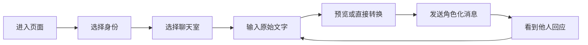

# 离谱聊天室 Demo 技术方案

> 版本：v0.1  
> 阶段：概念验证 / 可交互 Demo  
> 载体：桌面端优先的响应式 HTML 页面  
> 核心目标：验证“普通话经过角色身份转换后再发进聊天室”是否足够有趣、易懂、愿意分享。

## 1. 项目概述

“离谱聊天室”是一款以“身份化表达”为核心玩法的社交聊天产品。用户不是直接发送自己输入的原始文本，而是先选择一个身份；发送消息时，系统会把原话转换成该身份特有的表达方式，再展示在聊天室中。

例如：

- 用户身份：程序员
- 原始输入：`我吃了 3 个鸡蛋`
- 转换结果：

```js
for (let i = 0; i < 3; i++) {
  eat("egg");
}
```

产品的趣味不只来自“换一种说法”，而来自用户对不同身份表达方式的期待、误差和反差。Demo 首先验证这一条核心体验，不急于构建完整社交平台。

## 2. 第一性原理分析

### 2.1 用户为什么会使用

普通聊天室解决的是“把信息传出去”，离谱聊天室要解决的是“让表达本身变成内容”。它需要同时满足三个条件：

1. 转换结果能保留原意，否则无法沟通。
2. 角色风格足够明显，否则没有新鲜感。
3. 结果带有意外性和可传播性，否则只是普通的文字滤镜。

因此，产品价值公式可以简化为：

> 趣味性 = 原意可识别 × 角色辨识度 × 适度意外感

任何一项趋近于零，核心体验都会失效。

### 2.2 Demo 真正要验证的问题

Demo 不是为了证明能否做出聊天室，而是验证：

- 用户能否在几秒内理解“先选身份，再用该身份说话”。
- 用户是否愿意尝试多个身份并反复发送消息。
- 转换后的内容是否让用户觉得好笑、惊喜或值得截图分享。
- 自定义身份是否能显著提升留存和创造欲。
- 转换过程的等待时间是否会破坏聊天节奏。

### 2.3 最小闭环



Demo 必须完整实现这条闭环。登录注册、真实好友关系、消息持久化和多人实时通信暂不作为前置条件。

## 3. Demo 范围

### 3.1 本期包含

- 身份选择页。
- 3～6 个预设身份，首批建议包含程序员、英语老师、古风文人、霸道总裁、热血动漫角色、冷面客服。
- 自定义身份入口，可填写名称、简介、表达规则和示例。
- 聊天室选择页，提供若干模拟房间。
- 聊天室主界面。
- 原始文本输入与角色化转换。
- 转换中的视觉反馈。
- 消息气泡、代码块等多种结果展示形式。
- 本地模拟其他用户消息。
- 身份切换、重新生成、查看原文。
- 基础响应式布局，优先适配桌面端，同时保证手机端可操作。

### 3.2 本期不包含

- 正式账号体系与登录注册。
- 真实好友、搜索用户、好友申请。
- 后端数据库与跨设备同步。
- WebSocket 多人实时聊天。
- 内容审核后台、举报和封禁系统。
- 支付、订阅和虚拟道具。
- 正式生产环境中的大模型调用成本治理。

上述能力需要在产品核心玩法验证成立后再建设。

## 4. 用户流程与页面结构

### 4.1 身份选择页

目标是在首屏直接回答“我现在可以扮演谁”。

主要元素：

- 产品名称与一句话玩法说明。
- 大尺寸身份卡片，每张卡片展示名称、风格标签和一句示例。
- 卡片悬停时预演一句角色表达。
- “创建我的离谱身份”入口。
- 最近使用身份，可通过 `localStorage` 记录。

交互规则：点击身份卡片后立即选中，卡片产生明确的颜色、位移或形变反馈；点击“带着这个身份去聊天”进入房间选择页。

### 4.2 自定义身份弹窗或页面

建议字段：

| 字段 | 示例 | 是否必填 |
|---|---|---:|
| 身份名称 | 阴阳怪气产品经理 | 是 |
| 身份简介 | 所有句子都像在温柔地改需求 | 是 |
| 表达规则 | 爱用反问；不直接拒绝；常提“用户价值” | 是 |
| 示例转换 | “做不了” → “这个方案的用户价值可能需要再对齐一下” | 建议 |
| 主题颜色 | 酸橙绿 | 否 |

Demo 阶段保存到浏览器本地，不上传服务器。

### 4.3 聊天室选择页

用少量、有梗、容易理解的模拟房间，避免填充无意义数据。例如：

- 「甲方今晚不睡」
- 「英语角但没人说英语」
- 「周一情绪急救中心」

房间卡片只需显示房间名、当前话题、模拟在线人数和最近一条消息。点击后进入聊天室。

### 4.4 聊天室主界面

建议采用三栏或两栏结构：

- 左侧：房间列表与返回入口。
- 中间：消息流和输入区，是视觉重点。
- 右侧：当前身份、房间成员和玩法提示；窄屏时折叠。

输入区必须同时表达“原始输入”和“转换后发送”的关系：

- 输入框 placeholder：`先说人话，剩下的交给身份……`
- 主按钮：`转换并发送`
- 转换中：按钮进入 600～1200ms 的短动画状态。
- 结果发出后，可通过“查看原话”展示原始文本。
- 提供“换个说法”按钮，便于快速测试趣味性。

## 5. 角色转换机制

### 5.1 Demo 阶段：本地规则转换

初期不依赖大模型，使用本地 JavaScript 转换器确保页面离线可演示、结果稳定、无调用成本。

推荐接口：

```ts
type Role = {
  id: string;
  name: string;
  description: string;
  color: string;
  outputType: "text" | "code" | "mixed";
  examples: Array<{ input: string; output: string }>;
};

type TransformResult = {
  originalText: string;
  transformedText: string;
  format: "plain" | "markdown" | "code";
  language?: string;
};

async function transformMessage(
  originalText: string,
  role: Role
): Promise<TransformResult>;
```

本地转换策略：

- 程序员：识别数字、动作和对象，套用循环、函数调用、变量声明或注释模板。
- 英语老师：翻译或改写为教学口吻，并附带关键词、语法提示。
- 古风文人：替换高频现代词，增加古典句式，但保留核心语义。
- 创意角色：通过前缀、后缀、关键词替换和预制模板组合输出。
- 无法匹配时：使用通用角色模板，绝不返回空内容。

Demo 应保留 500～900ms 的模拟处理时间，让转换过程可被感知，但不应长到打断对话。

### 5.2 正式阶段：大模型转换

后续将 `transformMessage()` 的实现替换为后端 API，前端调用方式保持不变。

建议请求体：

```json
{
  "roomId": "room_001",
  "roleId": "programmer",
  "originalText": "我吃了3个鸡蛋",
  "context": ["最近若干条对话"],
  "roleDefinition": {
    "name": "程序员",
    "rules": ["优先使用代码表达", "保留原意", "不要解释代码"]
  }
}
```

建议响应体：

```json
{
  "transformedText": "for (let i = 0; i < 3; i++) { eat('egg'); }",
  "format": "code",
  "language": "javascript",
  "requestId": "req_xxx"
}
```

模型提示词应明确以下约束：保留事实和意图、不添加危险信息、不冒充真实专业结论、限制输出长度、遵守角色风格、返回结构化 JSON。原始文本和角色定义都属于不可信输入，后端需要避免提示词注入。

## 6. 前端技术方案

### 6.1 推荐实现

Demo 首版建议使用：

- HTML5：页面结构。
- CSS3：视觉系统、响应式布局和动效。
- 原生 JavaScript ES Modules：状态、路由和转换器。
- `localStorage`：保存自定义身份、最近选择和演示设置。
- Markdown/代码高亮：可选用轻量库；若希望单文件离线运行，可先自己处理有限格式。

如预计很快迭代为正式产品，可直接采用 Vite + React + TypeScript，但不应为了 Demo 引入复杂状态管理和组件库。

### 6.2 推荐目录

```text
lipu-chat-demo/
├── index.html
├── assets/
│   ├── fonts/
│   └── images/
├── styles/
│   ├── tokens.css
│   ├── base.css
│   ├── components.css
│   └── animations.css
├── scripts/
│   ├── app.js
│   ├── state.js
│   ├── router.js
│   ├── roles.js
│   ├── rooms.js
│   └── transformers.js
└── README.md
```

### 6.3 页面状态

```ts
type AppState = {
  currentView: "role-select" | "room-select" | "chat";
  currentRoleId: string | null;
  currentRoomId: string | null;
  customRoles: Role[];
  messagesByRoom: Record<string, Message[]>;
  isTransforming: boolean;
};
```

```ts
type Message = {
  id: string;
  senderId: string;
  senderName: string;
  roleId: string;
  originalText?: string;
  transformedText: string;
  format: "plain" | "markdown" | "code";
  language?: string;
  createdAt: number;
  status: "sending" | "sent" | "failed";
};
```

## 7. 视觉设计方向

### 7.1 总体气质

关键词：年轻、荒诞、直接、带一点地下文化与互联网亚文化感、强对比、有节奏，但不能牺牲聊天内容的可读性。

不建议采用常见的“深蓝背景 + 紫色渐变 + 统一圆角卡片”的泛 AI 产品风格。视觉冲击应来自清晰的构图、撞色、字号反差、角色专属视觉和有目的的动效，而不是全屏堆叠渐变与发光。

### 7.2 推荐主方向：数字贴纸 × 新粗野主义

推荐采用偏“数字贴纸 / 新粗野主义”的主视觉：

- 米白或近黑作为大面积底色。
- 荧光酸橙绿作为主品牌色。
- 高饱和橘红、钴蓝作为身份与状态辅助色。
- 粗黑描边、硬阴影、非对称排版和局部倾斜制造冲击。
- 大标题使用紧凑粗体，正文使用高可读中文黑体。
- 卡片可以有明确边界，但避免所有元素使用相同圆角和相同阴影。
- 代码消息保留等宽字体与终端感，和普通聊天气泡形成明显反差。

建议色板：

| 用途 | 色值 | 说明 |
|---|---|---|
| 主背景 | `#F3F0E8` | 降低长时间浏览疲劳 |
| 主文字 | `#111111` | 强对比 |
| 品牌主色 | `#C7FF00` | 酸橙绿，年轻且易识别 |
| 强调色 A | `#FF4D2E` | 用于警示、热度与关键按钮 |
| 强调色 B | `#2457FF` | 用于链接、选中与英语老师等身份 |
| 暗色面板 | `#181818` | 聊天区或代码块背景 |
| 浅色文字 | `#F7F4EC` | 暗色面板正文 |

所有颜色应在真实页面中进行 WCAG 对比度检查；酸橙绿更适合做背景或装饰，不宜直接承载小字号白色文字。

### 7.3 角色视觉系统

每个身份不仅更换头像，还应改变消息的表达载体：

- 程序员：终端窗口、代码行号、语法高亮。
- 英语老师：批注线、红笔修订、单词卡标签。
- 古风文人：竖排小印章、留白与纸张纹理的局部使用。
- 霸道总裁：大字号短句、极强黑白对比和签署感。
- 自定义角色：使用用户选择的主题色，但共用统一的信息层级。

这样才能让身份差异在“不读名字”的情况下依然可识别。

### 7.4 动效原则

- 身份卡片选中：100～180ms 的压下、回弹或硬阴影位移。
- 转换过程：文字短暂拆解、重排或扫描，不使用无意义的长加载动画。
- 新消息进入：轻微上移配合透明度变化，时长约 180～240ms。
- 切换身份：聊天输入区颜色和标签随身份改变，避免全页面剧烈闪烁。
- 支持 `prefers-reduced-motion`，为减少动态效果的用户关闭位移和重排。

### 7.5 可探索的两个备选方向

- 夜间弹幕俱乐部：近黑背景、暖橙和青色撞色、密集字幕与舞台灯光感；沉浸但更考验可读性。
- 校园手账拼贴：纸张、胶带、批注与荧光笔语言；亲切、易传播，但视觉力量略弱于推荐方向。

Demo 首版建议先落地“数字贴纸 × 新粗野主义”，另外两种可在后续做换肤或 A/B 视觉探索。

## 8. 核心组件

| 组件 | 职责 |
|---|---|
| `RoleCard` | 展示身份、示例、选中状态 |
| `RoleCreator` | 创建并预览自定义身份 |
| `RoomCard` | 展示房间摘要并进入聊天室 |
| `ChatHeader` | 房间信息与当前身份 |
| `MessageList` | 消息流、滚动和空状态 |
| `MessageBubble` | 根据输出格式渲染文本或代码 |
| `OriginalTextToggle` | 查看或隐藏原话 |
| `Composer` | 输入、转换、发送和失败重试 |
| `RoleSwitcher` | 聊天中快速切换身份 |
| `TransformIndicator` | 展示文字正在角色化 |

## 9. 安全与内容边界

即使是 Demo，也应提前保留这些原则：

- 使用 `textContent` 或可信的 Markdown 清洗器渲染用户内容，禁止直接写入 `innerHTML`。
- 代码块只展示，不执行。
- 自定义身份名称和规则需要限制长度。
- 本地数据解析失败时回退到默认状态。
- 正式接入大模型后，转换前后都需要内容安全检查。
- UI 应明确：转换内容是角色化表达，不能把模型生成内容包装成真实专业建议。
- “查看原话”默认只对消息发送者可见；真实多人产品中需要明确隐私策略。

## 10. 埋点与验证指标

Demo 可先在内存或控制台记录行为：

| 事件 | 用途 |
|---|---|
| `role_selected` | 哪些身份最有吸引力 |
| `room_entered` | 用户是否完成前置流程 |
| `message_transform_started` | 用户是否理解输入方式 |
| `message_transform_succeeded` | 转换链路是否稳定 |
| `message_regenerated` | 首次结果是否不够满意或用户爱玩 |
| `original_text_viewed` | 用户是否关心原文对照 |
| `custom_role_created` | 自定义角色的真实需求 |
| `role_switched_in_chat` | 多身份尝试意愿 |

首轮用户测试重点观察：首次成功发言耗时、每人平均转换次数、身份切换次数、主动截图或分享意愿，以及用户能否复述产品玩法。

## 11. 实施阶段

### 阶段 A：静态骨架

- 完成三个页面及页面切换。
- 建立设计变量和响应式布局。
- 填入预设身份、房间和模拟消息。

验收：无需后端即可完整走通选身份、选房间、进入聊天。

### 阶段 B：核心互动

- 实现本地角色转换器。
- 实现发送、重新生成、查看原文和身份切换。
- 加入加载、空状态和失败状态。

验收：至少 3 个身份对 10 条典型测试语句能输出明显不同且保留原意的结果。

### 阶段 C：视觉与演示打磨

- 落地强视觉色板和角色差异化消息样式。
- 完成关键微动效、窄屏适配和键盘交互。
- 准备 1～2 分钟固定演示脚本。

验收：第一次看到页面的人能在 10 秒内理解玩法，并在 30 秒内发送第一条角色化消息。

### 阶段 D：AI 接口验证（可选）

- 建立轻量后端代理，密钥不进入浏览器。
- 接入真实大模型并采用结构化输出。
- 增加超时、重试、降级和安全策略。

## 12. Demo 验收标准

- 页面可通过本地静态服务器运行，不依赖正式后端。
- 用户能选择预设身份并创建一个自定义身份。
- 用户能进入至少 3 个模拟聊天室。
- 输入原话后能看到明确的转换过程和角色化结果。
- 程序员身份能把包含数字的常见动作句转换为合理代码表达。
- 不同身份的输出语言和视觉载体有明显差异。
- 支持重新生成、查看原文和聊天中切换身份。
- 刷新后能保留自定义身份与最近选择。
- 桌面端与常见手机宽度下不存在关键内容遮挡。
- 所有用户输入均以安全方式渲染，代码不会被执行。

## 13. 主要风险与应对

| 风险 | 表现 | 应对 |
|---|---|---|
| 转换只剩形式、原意丢失 | 有梗但无法聊天 | 先保真，再加风格；提供查看原话 |
| 预设模板很快被玩腻 | 新鲜感短 | 自定义身份、重新生成、组合规则 |
| AI 等待破坏聊天节奏 | 用户发送后停顿过长 | 流式输出、短结果、超时降级 |
| 强视觉影响阅读 | 聊天区疲劳、信息层级混乱 | 冲击集中在入口和状态，正文保持克制 |
| 自定义角色被滥用 | 生成攻击性或违规内容 | 长度限制、审核与服务端策略 |
| Demo 技术债延续到生产 | 单机状态无法支持多人 | 通过接口隔离转换器和数据层，不直接复用模拟实现 |

## 14. 后续正式产品演进

当核心玩法验证成功后，建议按以下顺序演进：

1. 大模型角色转换与稳定的结构化输出。
2. 账号、角色云端保存和跨设备同步。
3. WebSocket 实时聊天室与历史消息。
4. 好友、私聊、邀请和房间管理。
5. 内容审核、举报、封禁和隐私控制。
6. 角色广场、角色分享与共创。
7. 成本、延迟、缓存、模型路由和可观测性。

不建议在核心趣味性尚未验证前优先开发完整社交关系链。

## 15. 当前决策摘要

- Demo 的唯一核心是“角色化表达”，不是完整聊天室基础设施。
- 首版采用纯前端实现，本地数据和规则转换保证演示稳定。
- 转换器通过统一接口隔离，未来可平滑替换为后端大模型。
- 主视觉采用“数字贴纸 × 新粗野主义”，以酸橙绿、橘红、钴蓝和黑白形成年轻、强烈、可识别的视觉语言。
- 视觉冲击集中在身份选择、转换状态和角色消息载体；长文本阅读区域保持高对比和克制。
- 第一轮验证重点是理解速度、重复尝试、角色切换和分享意愿。

